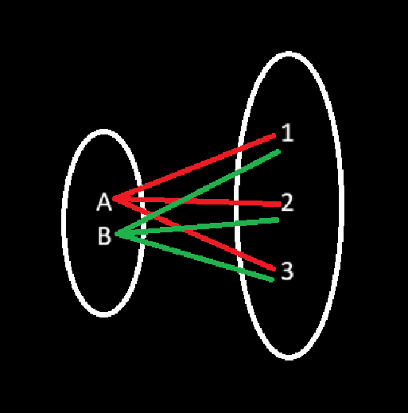

**Cartesian Product**

Cartesian Product of two sets A and B in the set of all ordered pairs, whose first members belong to the first set and second member belongs to the second set, denoted by AxB.

e.g.:

    A = {a,b}
    B = {1,2,3}

    

    AxB = {(a,1),(a,2),(a,3),(b,1),(b,2),(b,3)}

    It is a kind of maximum relation possible, where every member of the first set belong to every member of the second set.

    AxB = {(a,b) | a ∈ A and b ∈ B}

**Commutative law** means that order of certain operations does not affect the result.

e.g.:

    a+b=b+a
    a×b=b×a

In general for Cartesian Product the commutative law dos not hold good AxB != BxA

if | A | = m and | B | = n then | A x B | = mxn