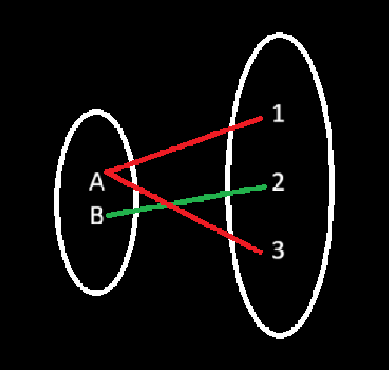

**Relation**

Let A and B are sets then every possible subset of 'AxB' is called a relation from A to B.

if | A | = m and | B | = n then total no of elements(pair) will be m*n, every element will have two choice weather to present or not present in the subset(relation) therefore the total number of relation possible is 2^m*n

e.g.:

    A = {a,b}
    B = {1,2,3}
    R = {(a,1),(a,3),(b,2)}

    

e.g.:

    A = {a,b}
    B = {1,2}
    AxB = {(a,1),(a,2),(b,1),(b,2)} - total number of elements
    total number of relation possible is 2^mxn -> 2^ 2*4

(a,1), (a,2), (b,1), (b,2), Total Possible Relations
----------------------------------------------------
0      , 0      , 0      , 0      , {}
1      , 0      , 0      , 0      , {(a,1)}
0      , 1      , 0      , 0      , {(a,2)}
0      , 0      , 1      , 0      , {(b,1)}
0      , 0      , 0      , 1      , {(b,2)}
1      , 1      , 0      , 0      , {(a,1), (a,2)}
1      , 0      , 1      , 0      , {(a,1), (b,1)}
1      , 0      , 0      , 1      , {(a,1), (b,2)}
0      , 1      , 1      , 0      , {(a,2), (b,1)}
0      , 1      , 0      , 1      , {(a,2), (b,2)}
0      , 0      , 1      , 1      , {(b,1), (b,2)}
1      , 1      , 1      , 0      , {(a,1), (a,2), (b,1)}
1      , 1      , 0      , 1      , {(a,1), (a,2), (b,2)}
1      , 0      , 1      , 1      , {(a,1), (b,1), (b,2)}
0      , 1      , 1      , 1      , {(a,2), (b,1), (b,2)}
1      , 1      , 1      , 1      , {(a,1), (a,2), (b,1), (b,2)}

**Complement of a relation**

Let R be a relation from A to B, then the complement of relation will be denoted by R', R^C, or 𝑅.

R' = {(a,b)|(a,b) ∈ AxB, (a,b) ∈! R}
R' = (AxB) - R
Relation complement = Universal set - Relation

e.g.:

    if AxB = {(a,1),(a,2),(a,3),(b,1),(b,2),(b,3)} // Cartesian product
    R (Relation) = {(a,1),(a,3),(b,2)} // suppose take 3 elements from above. The left overs are called complement.

    U (Universe) = AxB  
    R' (Relation complement) =  {(a,2),(b,1),(b,3)}

e.g.:

    R U R' = AxB
    R n R' = ∅

**Inverse of a relation**

Let R be a relation from A to B, then the inverse of relation  will be a relation from B to A, denoted by R^-1.

R^-1 = {(b,a) | (a,b) b ∈ R}

AxB = {(a,1), (a,2), (a,3), (b,1), (b,2), (b,3)}
R = {(a,1),(a,3),(b,2)}
R^-1 = {(1,a),(3,a),(2,b)}

|R| == |R^-1|

**Diagonal relation:**

A relation R on a set A is said to be diagonal relation if, R is a set of all ordered pair (x,x), for every ∀x ∈ A, sometime it is also denoted by Δ 
    A

R = {(x,x) | ∀ x ∈ A }