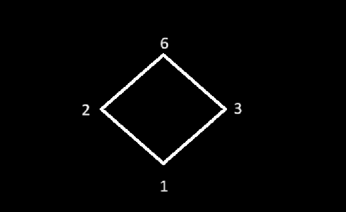
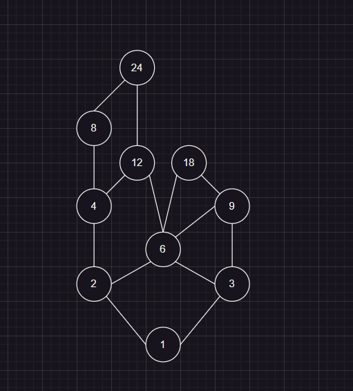
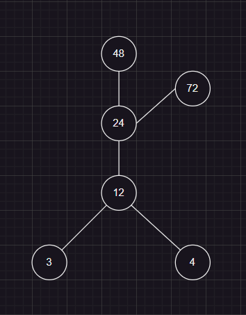
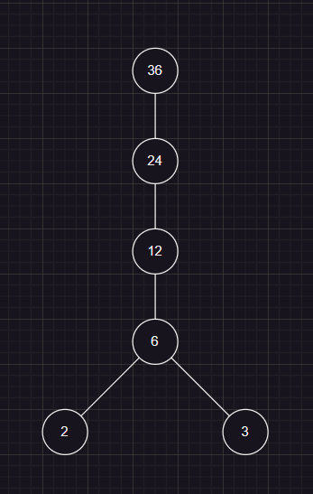

Question 01:

Consider a Partial order relation and convert it into hasse diagram?

R = {(1,1),(1,2),(1,3),(1,6),(2,2),(2,6),(3,3),(3,6),(6,6)}

Question 02 (previous year question):

Let A = (1,2,3,4,6,8,9,12,18,24) be ordered set with relation "x divides y". Draw its Hasse diagram?

Question 03:

Draw the Hasse diagram of (A, <=), where A = (3,4,12,24,48,72) and relation <= be such that a<=b if a divides b.

Question 04:

Let A = (2,3,6,12,24,36) and relation '<=' be sucj that x<=y if x divides y. Draw the Hasse diagram of (A, <=)?

