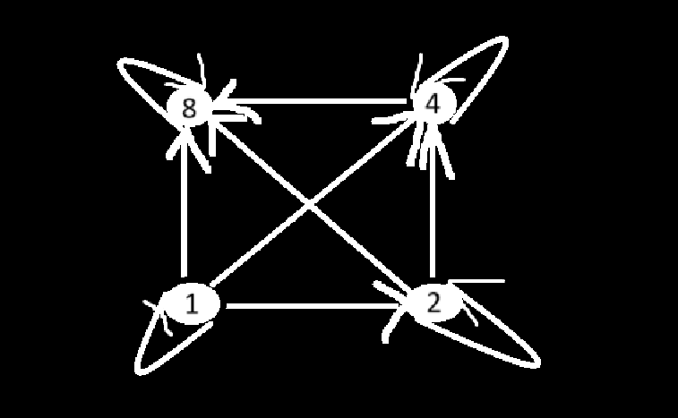
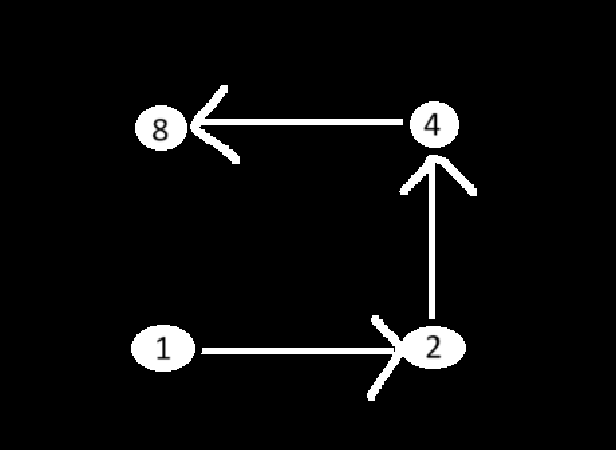
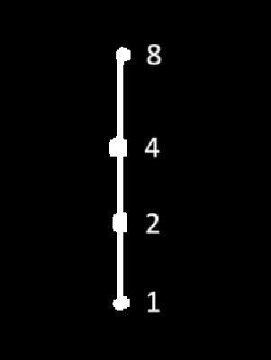

In order theory, a Hasse diagram is a type of mathematical diagram used to represent a finite partially ordered set, in the form of drawing of its transitive reduction. The diagrams are named after Helmut Hasse (1898-1979)

R = {(1,1),(1,2),(1,4),(1,8),(2,2),(2,4),(2,8),(4,4),(4,8),(8,8)}

check if this is Partial order relation:

That means it should have relations of:

1. Reflexive // (1,1),(2,2),(3,3),(4,4)
2. Anti -Symmetric // check if there is no a,b and b,a.
3. Transitive // we usually don't check for (1,1) so
(1,2) and (2,4). (1,2) and (2,8). (1,4) and (4,8). (2,4) and (4,8)

Steps to convert partial order relation into Hesse diagram - 

1. Draw a vertex for each element in the Set
2. If (a,b) ∈ R then draw an edge a to b.
3. Remove all Reflexive and Transitive edges
4. Remove the direction of edges and arrange them in the increasing order of height.

Step 1 & 2:

Step 3:

step 4:
Hasse diagram - 

Note:
Relationship is always from bottom to top.